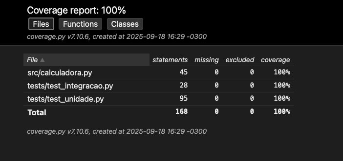

# Relatório dos Testes

## Resultados

- Testes executados: 21
- Testes aprovados: 21
- Testes falharam: 0
- Cobertura de código: 100%

## Problemas Encontrados

- Inicialmente houve erro de importação dos módulos (`ModuleNotFoundError` para `src`).
- Corrigido adicionando o diretório `src` ao `sys.path` nos arquivos de teste.

## Melhorias no Código

- Código da calculadora estava correto.  
- Ajustes feitos apenas na importação para rodar os testes.

## Lições Aprendidas

- Testes de unidade validam métodos individuais.  
- Testes de integração validam sequências de operações.  
- Cobertura mede a completude dos testes (atingimos 100%).  
- Organização de pastas/imports é fundamental para testes funcionarem.  
